My X timeline has been overrun by posts about OpenAI's recently released [GPT-6 model, Astra](https://openai.com/index/gpt-6-astra/). One of the first demos to catch my eye was [Dan Shipper's interactive reconstruction of Waterloo](https://x.com/danshipper/status/2095880567313092770). You can stand behind either formation, rise above the encounter, or stop at the volley and inspect the scene. A historical account becomes something you can explore.

Elsewhere in my feed, someone was [revising a robot in Onshape](https://x.com/Alpha10six/status/2096261751389978640) by describing the changes he wanted. Another person had [built a shooter populated by painters](https://x.com/petergostev/status/2096013280519016608), with a town that looked painted too. Alongside the visual spectacle were [new mathematical results checked by a formal proof system](https://epoch.ai/latest/announcing-frontiermath-erdos). With help from Codex, OpenAI's coding agent, I followed these and other examples to see what the excitement amounted to.

These demonstrations make a convincing case that Astra is a big jump in capability. The breadth, visual quality, and complexity of the work are striking, especially when projects span specialist tools and leave something people can continue editing. What the demos cannot tell us is how consistently Astra delivers, how much effort and expense sit behind the results, or how well the work holds up beyond the presentation. The examples below show why the excitement is warranted while keeping those open questions in view.

This is a tour of the first roughly 48 hours of public excitement, captured on September 5. Some creators had early access and worked for days or weeks; the window describes when the work came into view, not how long every project took.

## History You Can Walk Into

Shipper's [Waterloo reconstruction](https://x.com/danshipper/status/2095880567313092770) focuses on Maitland's Guards confronting the French advance. [Open the scene](https://waterloo-guard-meets-the-line.vercel.app/) and try the volley from either side of the encounter.

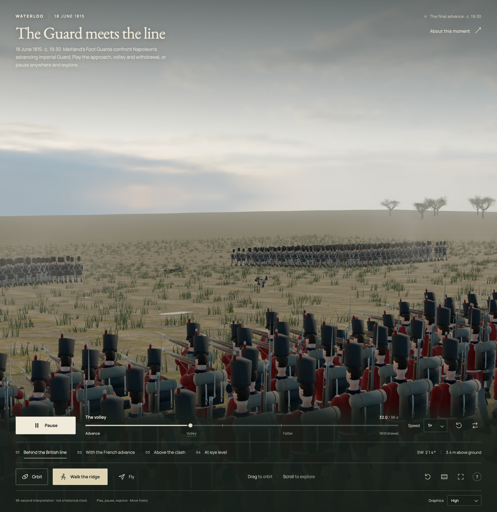{fig-alt="Waterloo reconstruction showing British troops in the foreground, a French formation across the field, and controls for time and viewpoint." width=760}

The reconstruction's [source notes](https://waterloo-guard-meets-the-line.vercel.app/) are worth opening. They distinguish the historical episode from choices made to represent it, including compressed choreography, terrain detail, and troop counts. They acknowledge disputed attribution and reused assets. That makes the experience more useful: you can enjoy the reconstruction while knowing which parts are interpretation. A rendered battlefield inevitably looks more definite than the surviving evidence.

Ethan Mollick's [Alexandria](https://x.com/emollick/status/2095601539066777748) connects an imagined ancient city to a [collection of texts you can read](https://alexandria-mouseion.netlify.app/). It distinguishes surviving editions from fragmentary or lost works, letting a visit to the city lead into its intellectual life. The collection is an interpretation, not a recovered library inventory.

Mollick's [walkthrough of Boullée's unbuilt Newton cenotaph](https://x.com/emollick/status/2096270461122347131) translates sketches and a description into a spatial experience. The unseen geometry has to be interpreted, but that is also the appeal: an unrealized design becomes easier to imagine at human scale.

A [Geobukseon turtle-ship demonstration](https://x.com/i/status/2096241698925916633) connects a ship's interior to a cinematic naval encounter inspired by Yi's campaigns. Moving from the machinery to the action helps explain how the vessel was intended to function, although the film's historical accuracy has not been established.

These examples suggest opportunities for museums, teachers, and anyone explaining something that happened in a place. Perspective carries information: the visitor can inspect a relationship that a fixed illustration has to choose for them.


```{=html}
<section class="demo-gallery" aria-label="More examples: History You Can Walk Into"><div class="gallery-toolbar"><span>More to explore · select an image to enlarge</span><div><button type="button" data-gallery="demo-gallery-1" data-step="-1" aria-label="Previous images in History You Can Walk Into">←</button><button type="button" data-gallery="demo-gallery-1" data-step="1" aria-label="Next images in History You Can Walk Into">→</button></div></div><div class="gallery-track" id="demo-gallery-1" tabindex="0" aria-label="Scrollable image gallery"><figure><a class="demo-enlarge" href="images/alexandria.png" data-caption="Alexandria — Ethan Mollick · city and reading collection" aria-label="Enlarge Alexandria">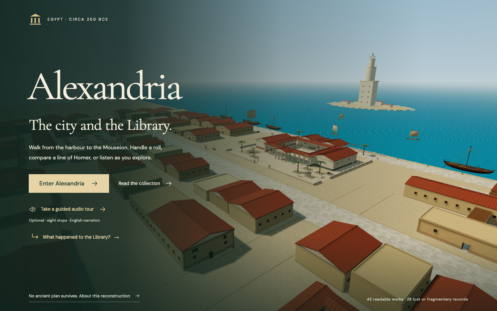</a><figcaption><a href="https://alexandria-mouseion.netlify.app/">Alexandria</a><span>Ethan Mollick · city and reading collection</span></figcaption></figure><figure><a class="demo-enlarge" href="images/cenotaph.png" data-caption="Newton’s cenotaph — Ethan Mollick · unbuilt architecture" aria-label="Enlarge Newton’s cenotaph">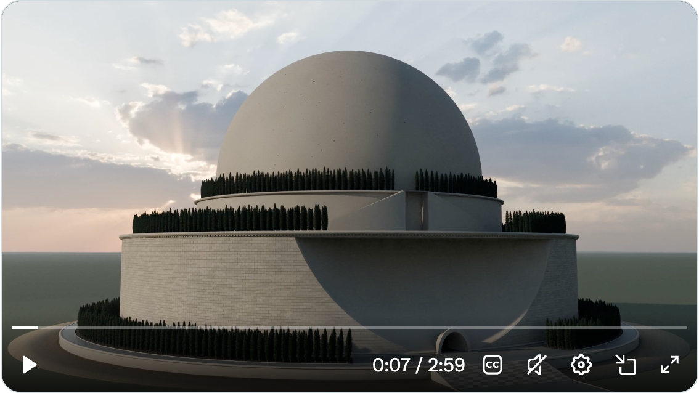</a><figcaption><a href="https://x.com/emollick/status/2096270461122347131">Newton’s cenotaph</a><span>Ethan Mollick · unbuilt architecture</span></figcaption></figure><figure><a class="demo-enlarge" href="images/turtle.png" data-caption="Turtle ship — Ship interior and naval reconstruction" aria-label="Enlarge Turtle ship">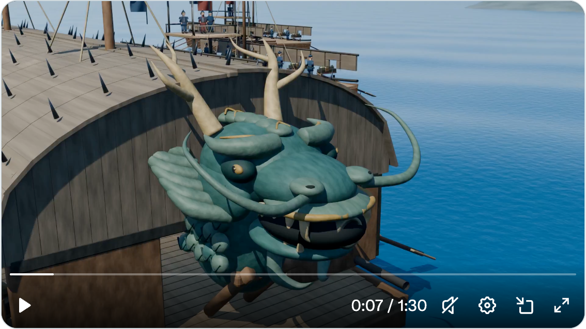</a><figcaption><a href="https://x.com/i/status/2096241698925916633">Turtle ship</a><span>Ship interior and naval reconstruction</span></figcaption></figure></div></section>
```

## Worlds, Visualizations, and Things Taken Apart

Matt Shumer's [Manhattan project](https://x.com/mattshumer_/status/2095609734845927525) turns a recognizable city into a drivable environment, with buildings and traffic giving it a street-level sense of scale. His [account of the work](https://somethingbig.ai/a) describes roughly a week of construction in the Unreal game engine, with a coordinating agent directing other agents, existing assets, and substantial token consumption. The city is unfinished, but the sustained construction is impressive on its own terms.

{fig-alt="An orange sports car on a detailed Manhattan street, with buildings and traffic." width=760}

[Void Explorer's development account](https://developers.openai.com/blog/how-to-build-games-with-astra) follows the engineering behind a continuous journey from space to planetary surfaces. Moving between those scales while keeping the terrain, motion, and rendering coherent is a substantial problem. The account exposes the design decisions and corrections that a short clip leaves out.

Peter Gostev's [Van Gogh's Town](https://van-goghs-town.surge.sh/) brings six paintings into a walkable environment, carrying their visual vocabulary through a shared space. Mollick's [ABYSSAL](https://x.com/emollick/status/2095673885605630429) adds procedural marine behavior to underwater exploration, giving the surroundings activity of their own.

A [Shanghai Bund reconstruction](https://x.com/yiyangleex/status/2096290966550544893) starts from one photograph and passes through Blender, a 3D creation tool, and the Godot game engine. A flat reference becomes somewhere you can move around, with the inevitable qualification that unseen detail has to be invented.

The [male-anatomy demonstration by @ashebytes](https://x.com/ashebytes/status/2096221988763173186) separates the body into what the creator describes as 2,234 modeled pieces. An exploded view reveals relationships that a surface image hides, letting a viewer move between the whole and its components. Anatomical accuracy still needs expert checking, but the interaction has an obvious use: take a complicated structure apart, inspect its organization, then put it back together.

The same approach could help explain an engine, a building, or an instrument. Getting the relationships right determines whether it teaches something useful.


```{=html}
<section class="demo-gallery" aria-label="More examples: Worlds, Visualizations, and Things Taken Apart"><div class="gallery-toolbar"><span>More to explore · select an image to enlarge</span><div><button type="button" data-gallery="demo-gallery-2" data-step="-1" aria-label="Previous images in Worlds, Visualizations, and Things Taken Apart">←</button><button type="button" data-gallery="demo-gallery-2" data-step="1" aria-label="Next images in Worlds, Visualizations, and Things Taken Apart">→</button></div></div><div class="gallery-track" id="demo-gallery-2" tabindex="0" aria-label="Scrollable image gallery"><figure><a class="demo-enlarge" href="images/vangogh.png" data-caption="Van Gogh’s Town — Peter Gostev · a walkable painting" aria-label="Enlarge Van Gogh’s Town">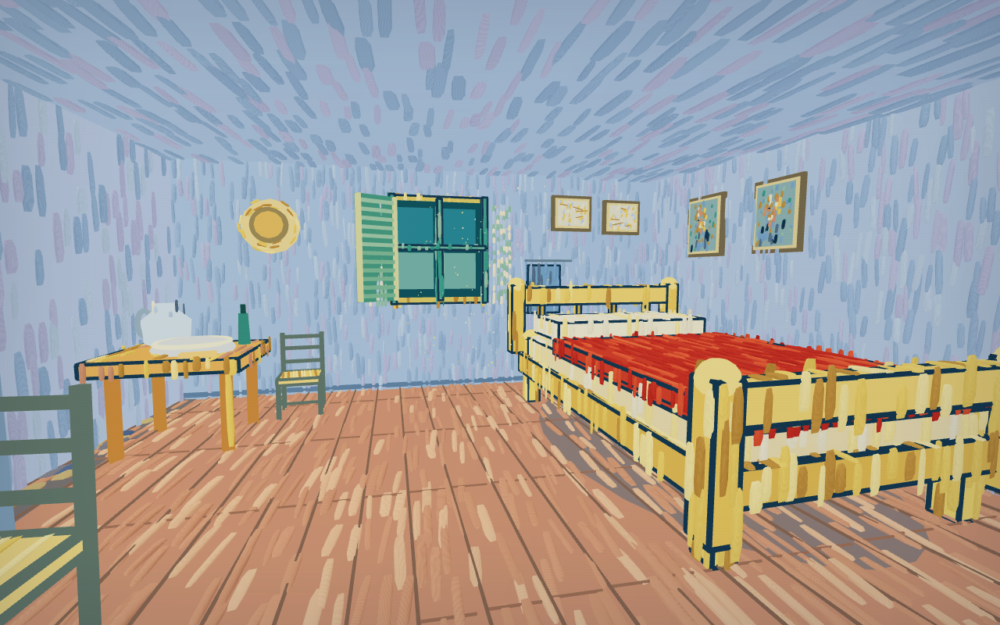</a><figcaption><a href="https://van-goghs-town.surge.sh/">Van Gogh’s Town</a><span>Peter Gostev · a walkable painting</span></figcaption></figure><figure><a class="demo-enlarge" href="images/abyssal.png" data-caption="ABYSSAL — Ethan Mollick · underwater environment" aria-label="Enlarge ABYSSAL">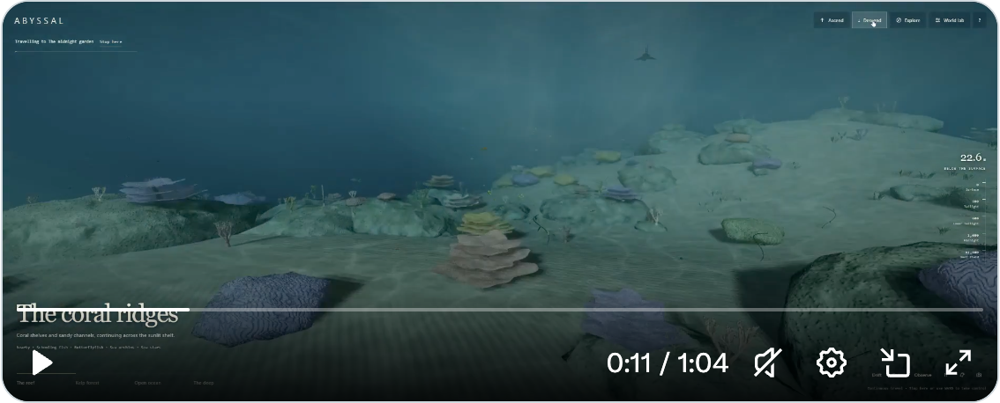</a><figcaption><a href="https://x.com/emollick/status/2095673885605630429">ABYSSAL</a><span>Ethan Mollick · underwater environment</span></figcaption></figure><figure><a class="demo-enlarge" href="images/shanghai.png" data-caption="Shanghai Bund — @yiyangleex · photograph to world" aria-label="Enlarge Shanghai Bund">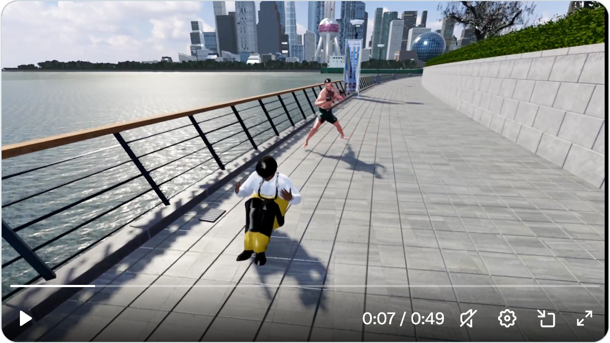</a><figcaption><a href="https://x.com/yiyangleex/status/2096290966550544893">Shanghai Bund</a><span>@yiyangleex · photograph to world</span></figcaption></figure><figure><a class="demo-enlarge" href="images/anatomy.png" data-caption="Exploded anatomy — @ashebytes · body and components" aria-label="Enlarge Exploded anatomy">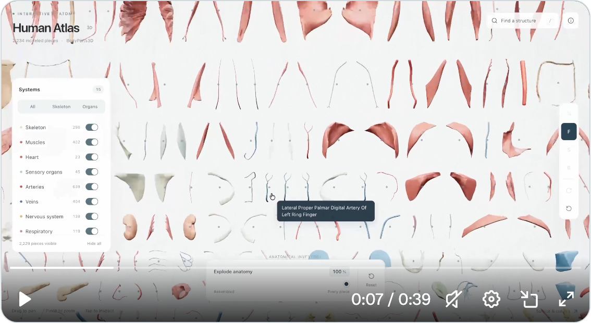</a><figcaption><a href="https://x.com/ashebytes/status/2096221988763173186">Exploded anatomy</a><span>@ashebytes · body and components</span></figcaption></figure></div></section>
```

## CAD for Real-World Design

The [Onshape rover from @Alpha10six](https://x.com/Alpha10six/status/2096261751389978640) prompted a closer look at CAD. The creator describes dictating revisions while Codex works through a backend connector it built. He explicitly says that he controls the mouse and model views. This is a shared design workflow with a fairly clear division of labor.

The revisions are practical: change the camera bracket, move the Jetson compute module so its ports remain accessible, and add ventilation. The video shows the assembly and the relationships that position its parts, alongside a correction to bracket orientation. This is where the rover gets interesting to me. A real component has ports you need to reach, and a mounting bracket can be beautifully modeled while facing the wrong way.

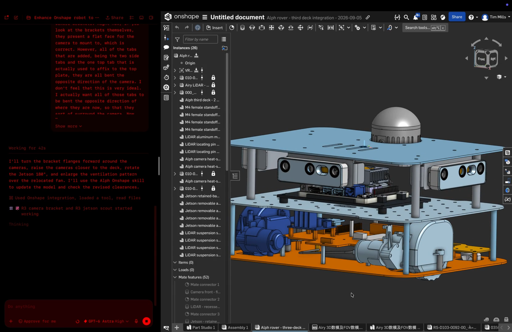{fig-alt="Onshape rover assembly beside the agent conversation, showing cameras, sensors, and stacked chassis plates." width=760}

Parametric modeling deserves its own distinction here. A useful model contains dimensions and relationships that let a change propagate sensibly. Making something that looks like a robot is one accomplishment. Preserving its design intent when a sensor gets wider is a further requirement. The visible rover workflow provides evidence of assembly editing, but without the native document I cannot establish that its constraints and dependent features survive arbitrary revisions.

An [S-scale model-train project](https://www.reddit.com/r/codex/comments/1w7rvgr/astra_just_built_my_sscale_model_train_in_onshape/) adapts an NS6400 locomotive body to an existing GP7 chassis. Its owner reports building geometry with Onshape's FeatureScript language and iterating on snap-fits, lighting, printability, and a small fit-test piece. The chassis already exists, so the new body has to fit something outside the model.

Adam's [Aurora TF-01 cutaway turbofan](https://x.com/adamdotnew/status/2096053889141489669) makes an engine's internal arrangement and motion understandable. The footage shows 140 assembly instances, relationships between parts, and animation controls. It establishes more than a beauty render, although the native design would be needed to test how well it tolerates a dimensional change.

The [SO-101 arm](https://x.com/MakerMatters/status/2096262183281692918) exposes an assembly and mechanism controls in WebCAD, making the relationships between moving parts available to inspect. A [FreeCAD scooter redesign](https://x.com/heecheee/status/2096179696245629412) brings the workflow into an open-source CAD application, giving people a way to explore agent-assisted mechanical design without a commercial CAD platform.

Fabrication begins to close the loop. The creator of a [dual-GB10 enclosure](https://x.com/mr_r0b0t/status/2096266507839824353) reports printing test coupons for a fourth iteration. A coupon tests a small physical question before committing to the whole part. It does not establish a completed enclosure or adequate cooling, but it is exactly the sort of feedback that can make an agent-assisted design process useful.


```{=html}
<section class="demo-gallery" aria-label="More examples: CAD for Real-World Design"><div class="gallery-toolbar"><span>More to explore · select an image to enlarge</span><div><button type="button" data-gallery="demo-gallery-3" data-step="-1" aria-label="Previous images in CAD for Real-World Design">←</button><button type="button" data-gallery="demo-gallery-3" data-step="1" aria-label="Next images in CAD for Real-World Design">→</button></div></div><div class="gallery-track" id="demo-gallery-3" tabindex="0" aria-label="Scrollable image gallery"><figure><a class="demo-enlarge" href="images/turbofan.png" data-caption="Aurora TF-01 — Adam · cutaway turbofan assembly" aria-label="Enlarge Aurora TF-01">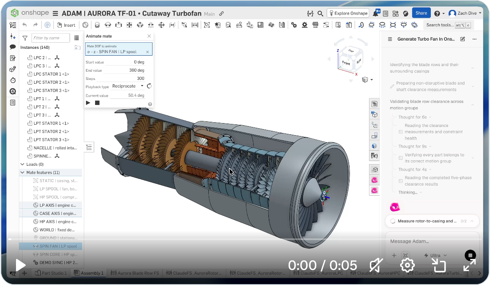</a><figcaption><a href="https://x.com/adamdotnew/status/2096053889141489669">Aurora TF-01</a><span>Adam · cutaway turbofan assembly</span></figcaption></figure><figure><a class="demo-enlarge" href="images/so101.png" data-caption="SO-101 arm — MakerMatters · articulated assembly" aria-label="Enlarge SO-101 arm">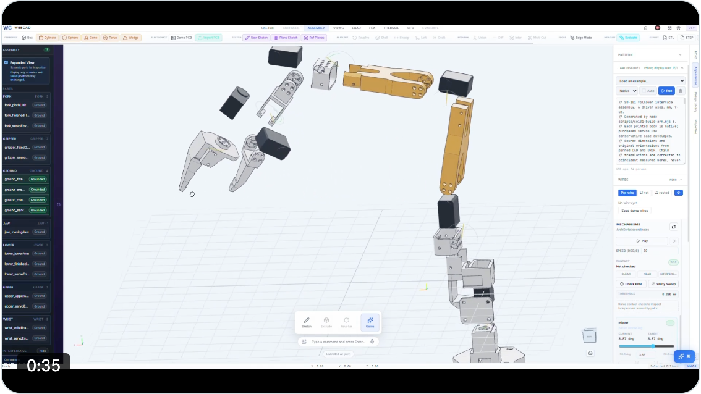</a><figcaption><a href="https://x.com/MakerMatters/status/2096262183281692918">SO-101 arm</a><span>MakerMatters · articulated assembly</span></figcaption></figure><figure><a class="demo-enlarge" href="images/scooter.png" data-caption="FreeCAD scooter — @heecheee · design comparison" aria-label="Enlarge FreeCAD scooter">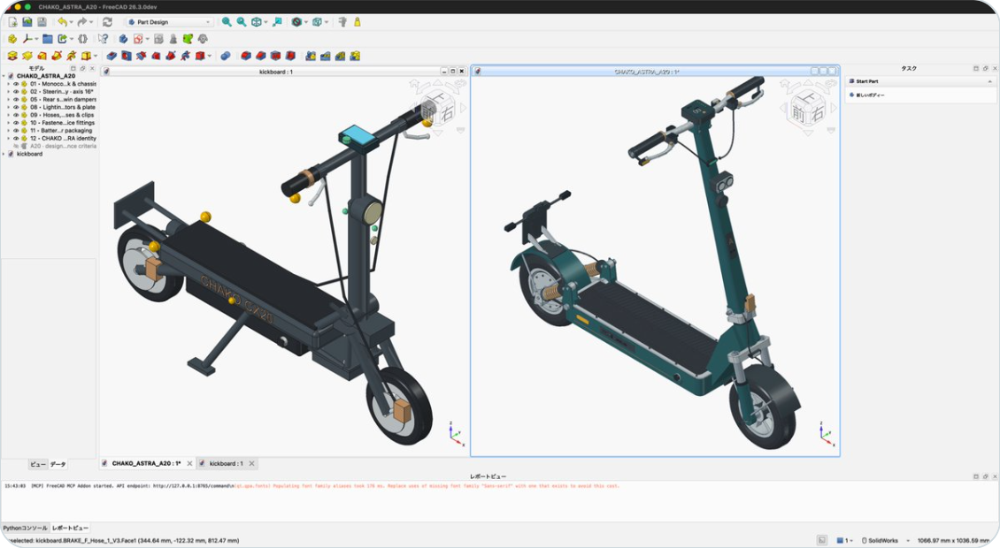</a><figcaption><a href="https://x.com/heecheee/status/2096179696245629412">FreeCAD scooter</a><span>@heecheee · design comparison</span></figcaption></figure><figure><a class="demo-enlarge" href="images/enclosure.png" data-caption="Dual-GB10 enclosure — @mr_r0b0t · fabrication workflow" aria-label="Enlarge Dual-GB10 enclosure">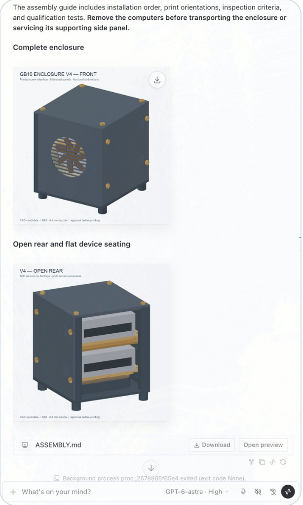</a><figcaption><a href="https://x.com/mr_r0b0t/status/2096266507839824353">Dual-GB10 enclosure</a><span>@mr_r0b0t · fabrication workflow</span></figcaption></figure></div></section>
```

## Games With Different Ambitions

Peter Gostev's [Gogh Strike](https://x.com/petergostev/status/2096013280519016608) gives painters weapons and rival crews in a painted town. The concept is funny, and the art direction carries through the characters, environment, and interface. There are timed matches and scoring, so here the interaction is organized around a game you can win or lose.

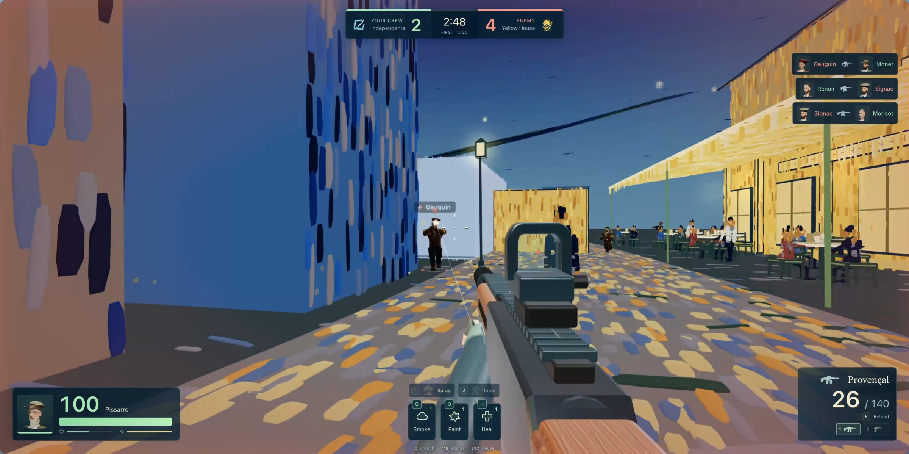{fig-alt="First-person view down a Gogh Strike street, with painterly patches of blue and yellow across buildings and pavement." width=760}

The [Gogh Strike repository](https://github.com/petergpt/gogh-strike) describes play against bots and explicitly says online multiplayer is absent. That matters when interpreting the creator's team-play description. The source also makes the implementation available to inspect, and you can [try the game yourself](https://gogh-strike.surge.sh/).

Meng To's [Thornwake](https://x.com/MengTo/status/2096213835460084184) brings a different kind of polish. Its forest, stonework, armor, inventory, and ornamental controls share a coherent visual style, while the footage shows quests, combat, health, stamina, and a boss encounter. Meng says the rocks, trees, monuments, and characters are procedural code, with GPT Image 2 supplying interface artwork. He also describes having Astra recreate the scenes in Blender and make a trailer, carrying one project from an interactive game into cinematic presentation. He kept pushing for better details, an instructive example of a person supplying standards while the agent does substantial production work.

::: {layout-ncol=2}
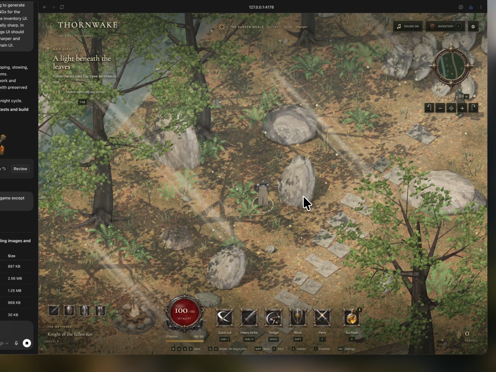{fig-alt="Thornwake gameplay showing a wooded stone path, character, quest, and ornamental action controls."}

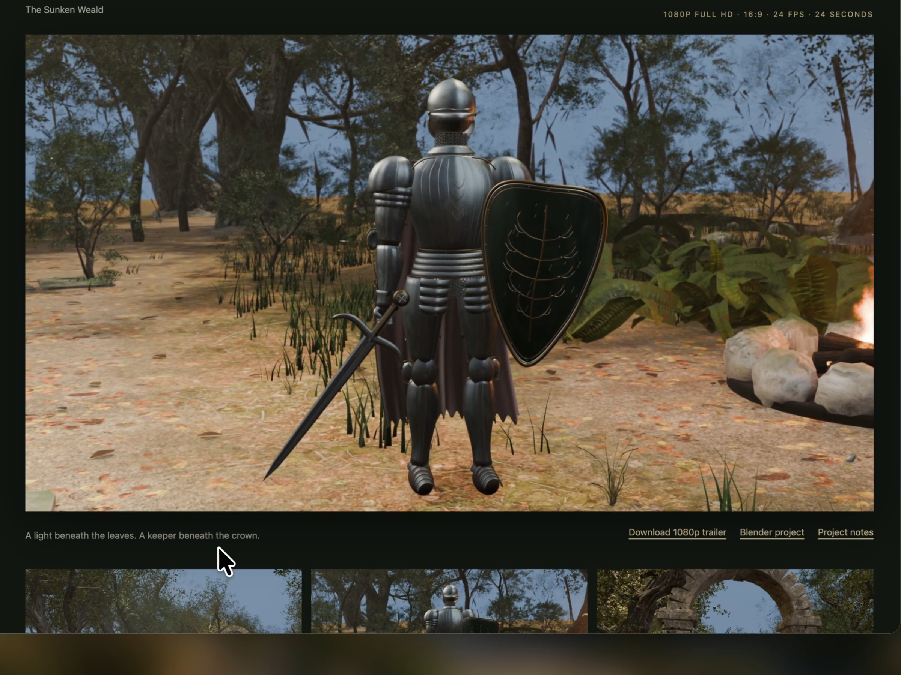{fig-alt="Armored Thornwake character holding a sword and shield in a forest scene from the trailer."}
:::

Mollick's [Zork in 3D](https://zork-underground-empire.netlify.app/) translates a text adventure into a spatial experience, with proximity guidance, inventory, a journal, and treasure tracking. A place once described in words becomes somewhere to navigate. How well all the original puzzles survive that translation is a question for a longer playthrough.

[VECTOR RUSH](https://x.com/AIDREAMMAN/status/2096284215126229146), an antigravity racer built with Godot and Blender, supplies a [repository](https://github.com/ToBeWin/vector-rush) for people who want to inspect how its fast-moving track, vehicle, and controls fit together. An [FTL-like demonstration](https://x.com/SIGKITTEN/status/2095647833797824735) claims that the agent plays its own game, which could let it discover problems in the rules it implemented and then revise them.

A [Game Boy ROM](https://x.com/LumenMythTech/status/2096292333318717859) targets hardware with little memory and a tiny display. A [parent's account of making a racing game with a nine-year-old](https://x.com/suganthan/status/2096286445434708416) raises a different possibility: more people may be able to participate in making games, with guidance.

Game feel, balance, performance, and sustained enjoyment still need players. The examples already span art direction, adaptation, self-testing, legacy hardware, and a change in who gets to make something.


```{=html}
<section class="demo-gallery" aria-label="More examples: Games With Different Ambitions"><div class="gallery-toolbar"><span>More to explore · select an image to enlarge</span><div><button type="button" data-gallery="demo-gallery-4" data-step="-1" aria-label="Previous images in Games With Different Ambitions">←</button><button type="button" data-gallery="demo-gallery-4" data-step="1" aria-label="Next images in Games With Different Ambitions">→</button></div></div><div class="gallery-track" id="demo-gallery-4" tabindex="0" aria-label="Scrollable image gallery"><figure><a class="demo-enlarge" href="images/zork.png" data-caption="Zork in 3D — Ethan Mollick · spatial adventure" aria-label="Enlarge Zork in 3D">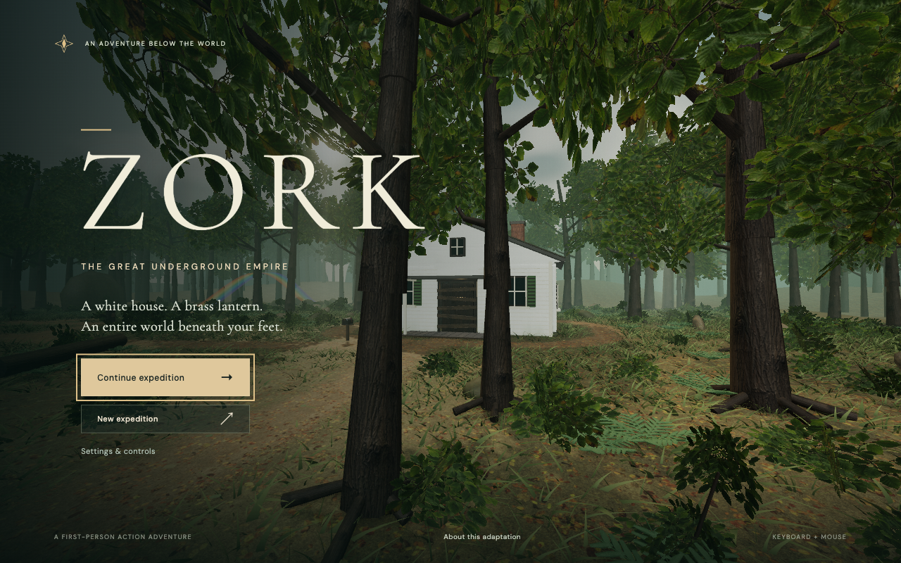</a><figcaption><a href="https://zork-underground-empire.netlify.app/">Zork in 3D</a><span>Ethan Mollick · spatial adventure</span></figcaption></figure><figure><a class="demo-enlarge" href="images/vector.png" data-caption="VECTOR RUSH — @AIDREAMMAN · antigravity racing" aria-label="Enlarge VECTOR RUSH">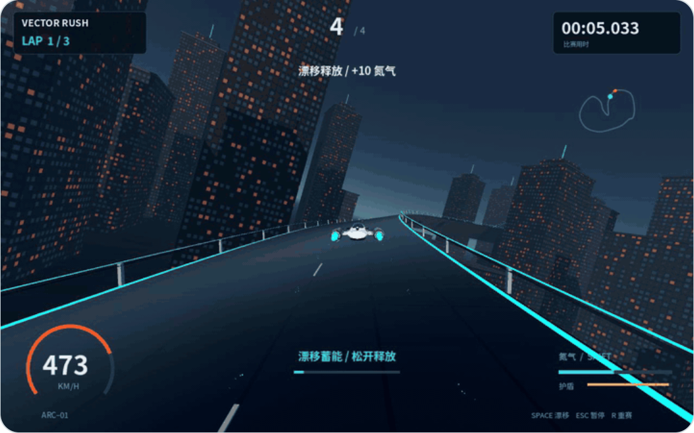</a><figcaption><a href="https://x.com/AIDREAMMAN/status/2096284215126229146">VECTOR RUSH</a><span>@AIDREAMMAN · antigravity racing</span></figcaption></figure><figure><a class="demo-enlarge" href="images/ftl.png" data-caption="FTL-like game — @SIGKITTEN · agent self-play" aria-label="Enlarge FTL-like game">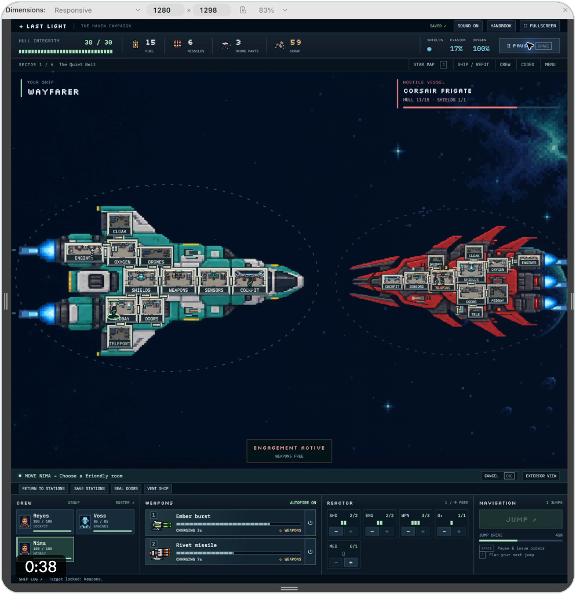</a><figcaption><a href="https://x.com/SIGKITTEN/status/2095647833797824735">FTL-like game</a><span>@SIGKITTEN · agent self-play</span></figcaption></figure><figure><a class="demo-enlarge" href="images/gameboy.png" data-caption="Lumen Echo — LumenMythTech · Game Boy ROM" aria-label="Enlarge Lumen Echo">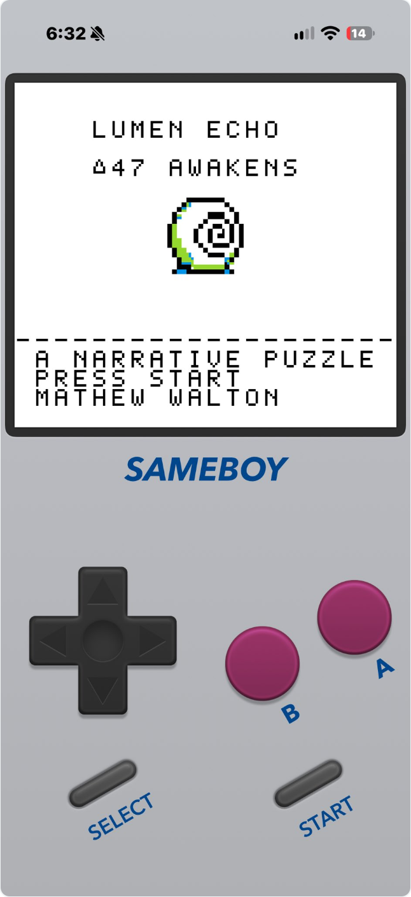</a><figcaption><a href="https://x.com/LumenMythTech/status/2096292333318717859">Lumen Echo</a><span>LumenMythTech · Game Boy ROM</span></figcaption></figure><figure><a class="demo-enlarge" href="images/child-racer.png" data-caption="Making a racing game — @suganthan · parent-guided creation" aria-label="Enlarge Making a racing game">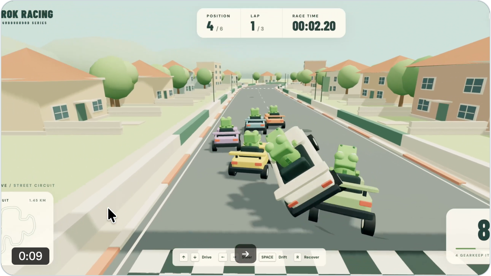</a><figcaption><a href="https://x.com/suganthan/status/2096286445434708416">Making a racing game</a><span>@suganthan · parent-guided creation</span></figcaption></figure></div></section>
```

## Science, Simulation, and Checkable Reasoning

Mehran [brought a fly simulation into the browser](https://x.com/mehrantsi/status/2096282317148885453), connecting neural activity to movement through a simulated room. The interface puts the animal, its surroundings, and its neural and sensory readouts together, making a complicated research model easier to inspect and share.

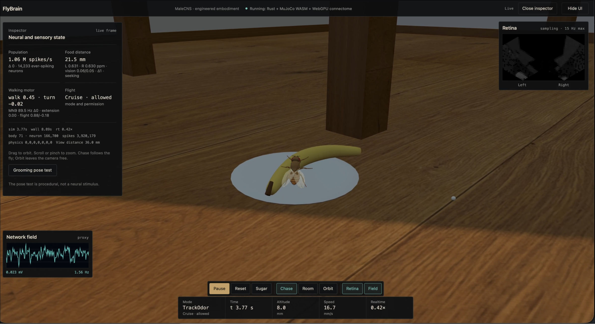{fig-alt="A simulated fly beside food on a wooden surface, with neural activity and sensory panels." width=760}

The creator clearly separates earlier work assisted by Sol, Astra's predecessor, from Astra's newer contribution: integrating brain and nerve-cord data and moving the simulation into the browser. That makes the contribution easier to understand. The demonstration is evidence of scientific-software integration; its biological fidelity needs comparison with experimental results.

An [orbital-rendezvous simulation](https://x.com/i/status/2096225621303042258) tackles bringing spacecraft together under guidance and docking constraints. Its explicit success criteria make the motion something to evaluate. A [Trackmania physics reconstruction](https://x.com/achepta_tm/status/2096258619574513880) aims to reproduce driving behavior in a browser, creating a way to experiment with the physics behind a familiar game. Both invite comparison with an external behavioral standard.

[Jet Factory V2](https://x.com/konstantinsaifo/status/2096260471020011981) depicts machine cycles and a returning tug, helping a viewer follow how production and transport fit together. A [cell-motility sandbox](https://x.com/tsuname/status/2096283873214956016) exposes stresses and gradients as controls, suggesting a way to explore how changing conditions changes movement.

Shumer's [inhabited civilization](https://x.com/mattshumer_/status/2095596175705399482) adds agent-driven inhabitants, creating an environment whose interest includes what its occupants do. These are useful forms for exploring a process, but their apparent behavior does not establish a validated factory, cell, or social model.

Mathematics offers a different kind of result. In [Epoch's FrontierMath Erdős evaluation](https://epoch.ai/latest/announcing-frontiermath-erdos), Astra produced verified solutions to two of 68 open problems under the benchmark protocol. Additional attempts brought the unique total to five, with larger budgets and changed agent setups. Those are different results and should stay separate.

The proofs are checked in Lean, a system that lets a computer verify a formal mathematical argument, provided the problem has been expressed correctly. The [proof repository](https://github.com/epoch-research/LeanOpenProblems) exposes the work. A checked solution to an open problem gives us firmer evidence of reasoning than an explanation that merely sounds convincing, while still covering only a narrow part of mathematics.

For a more approachable reasoning example, [BabaIsBench](https://quesma.com/benchmarks/babaisbench/) tests solving levels of *Baba Is You*, where rearranging words changes the game's rules. Its reported 15 Lake-level solutions concern reasoning through those changing rules. The text interface and different agent setups matter when comparing systems.


```{=html}
<section class="demo-gallery" aria-label="More examples: Science, Simulation, and Checkable Reasoning"><div class="gallery-toolbar"><span>More to explore · select an image to enlarge</span><div><button type="button" data-gallery="demo-gallery-5" data-step="-1" aria-label="Previous images in Science, Simulation, and Checkable Reasoning">←</button><button type="button" data-gallery="demo-gallery-5" data-step="1" aria-label="Next images in Science, Simulation, and Checkable Reasoning">→</button></div></div><div class="gallery-track" id="demo-gallery-5" tabindex="0" aria-label="Scrollable image gallery"><figure><a class="demo-enlarge" href="images/orbital.png" data-caption="Orbital rendezvous — Guidance and docking simulation" aria-label="Enlarge Orbital rendezvous">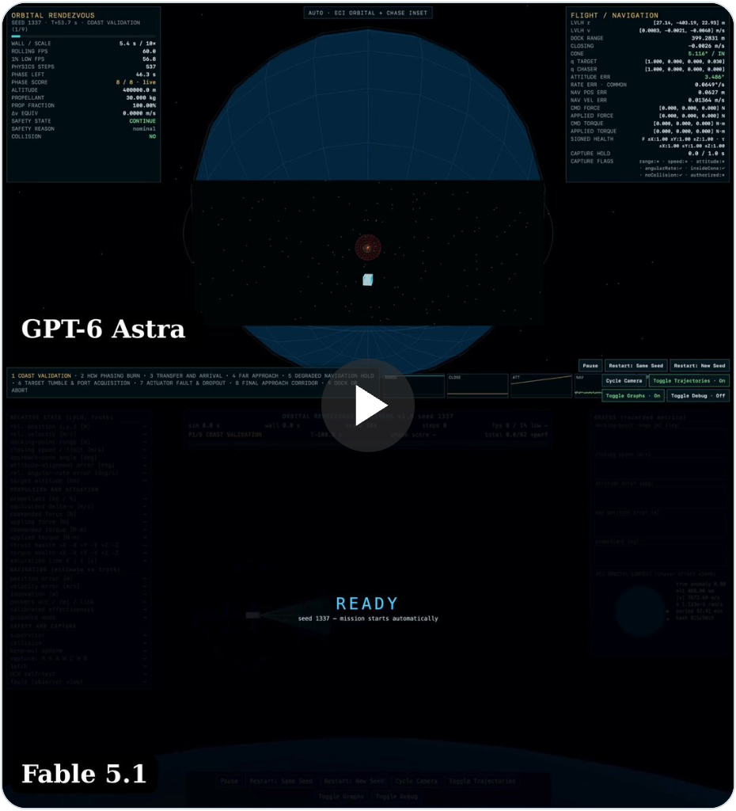</a><figcaption><a href="https://x.com/i/status/2096225621303042258">Orbital rendezvous</a><span>Guidance and docking simulation</span></figcaption></figure><figure><a class="demo-enlarge" href="images/trackmania.png" data-caption="Trackmania physics — @achepta_tm · behavioral reconstruction" aria-label="Enlarge Trackmania physics">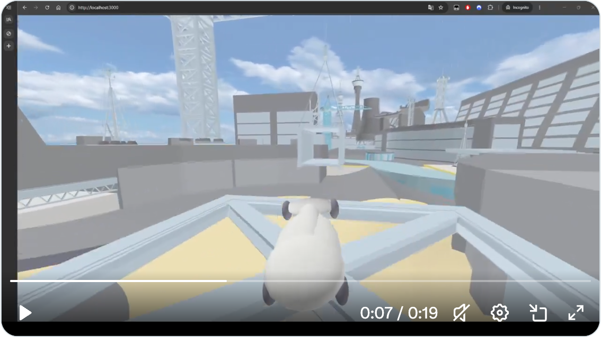</a><figcaption><a href="https://x.com/achepta_tm/status/2096258619574513880">Trackmania physics</a><span>@achepta_tm · behavioral reconstruction</span></figcaption></figure><figure><a class="demo-enlarge" href="images/factory.png" data-caption="Jet Factory V2 — @konstantinsaifo · production flow" aria-label="Enlarge Jet Factory V2">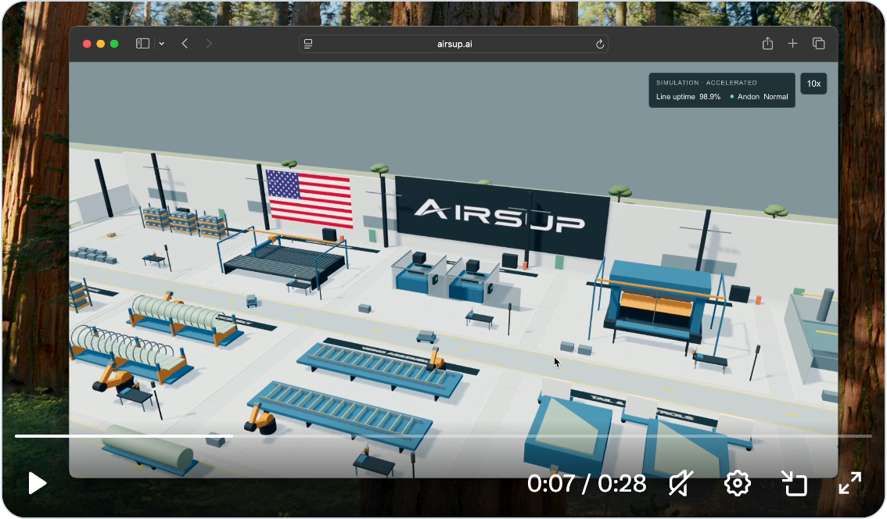</a><figcaption><a href="https://x.com/konstantinsaifo/status/2096260471020011981">Jet Factory V2</a><span>@konstantinsaifo · production flow</span></figcaption></figure><figure><a class="demo-enlarge" href="images/cell.png" data-caption="Cell motility — @tsuname · an interactive sandbox" aria-label="Enlarge Cell motility">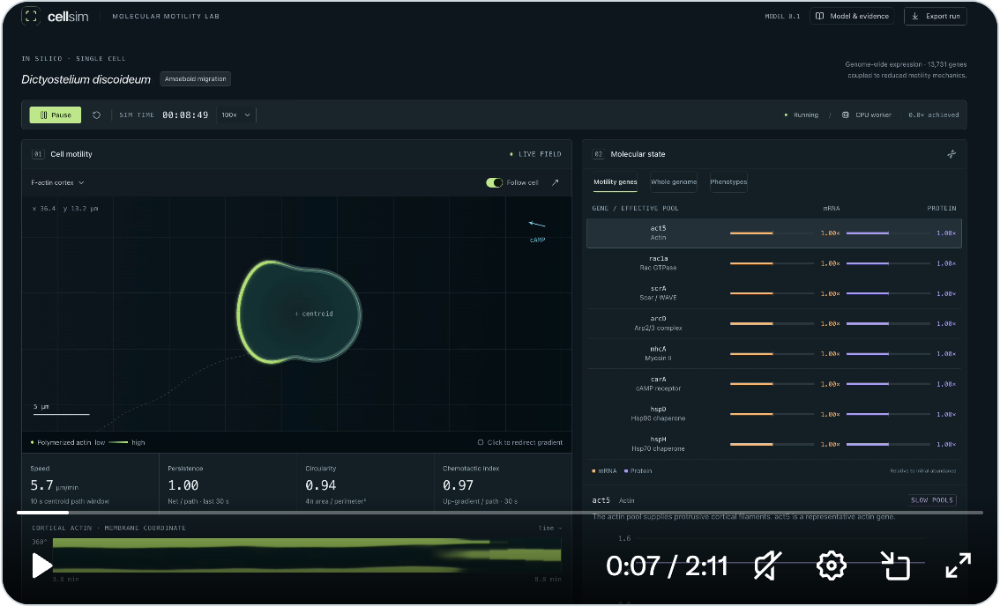</a><figcaption><a href="https://x.com/tsuname/status/2096283873214956016">Cell motility</a><span>@tsuname · an interactive sandbox</span></figcaption></figure><figure><a class="demo-enlarge" href="images/civilization.png" data-caption="Inhabited civilization — Matt Shumer · agent-driven inhabitants" aria-label="Enlarge Inhabited civilization">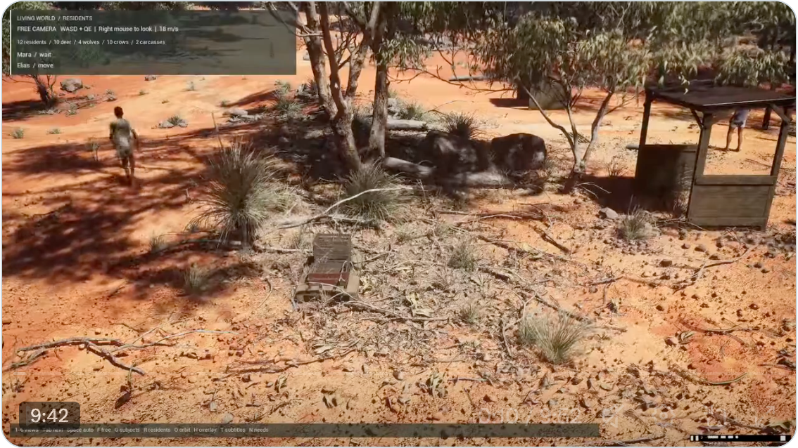</a><figcaption><a href="https://x.com/mattshumer_/status/2095596175705399482">Inhabited civilization</a><span>Matt Shumer · agent-driven inhabitants</span></figcaption></figure></div></section>
```

## Music, Film, and Explanations Across Media

Pietro Schirano's [Ableton demonstration](https://x.com/skirano/status/2095595942544089525) describes creating synthesized instruments, musical parts, and an arrangement through a connection to the music-production application. The result remains in a project where someone can change individual notes, instruments, or sections. That continued control is a large part of the appeal. [Listen to the track](https://x.com/skirano/status/2095595942544089525) and judge the musical result for yourself.

.](images/ableton.png){fig-alt="Ableton arrangement view with colored instrument tracks, named song sections, and a MIDI note editor." width=760}

A [Higgsfield piano demonstration](https://x.com/higgsfield_ai/status/2096292350180163648) combines a composed waltz with a 3D pianist whose fingers are claimed to follow the notes. Synchronization gives this an additional constraint: the animation has to correspond to the music, rather than simply accompany it.

In [A Room Made of Replies](https://x.com/SkyeSharkie/status/2096276401204936939), a robotic arm and a furnished scene give the film a concrete physical setting. The creator also describes adapting the production tools, extending the agent's role into how the film gets made.

An [INCEPTION title sequence](https://x.com/lepadphone/status/2096285071192035406) uses architectural imagery and moving typography to pursue a recognizable cinematic style. Its creator explicitly excludes the music from Astra's contribution. [Duncan Trussell's Backrooms film](https://x.com/duncantrussell/status/2096003511104508411) works through the uneasy atmosphere of fluorescent rooms and an unsettling figure, where staging and mood matter as much as individual objects.

Thornwake's [game-to-Blender trailer workflow](https://x.com/MengTo/status/2096213835460084184) belongs here too: environments and characters developed for play become material for a cinematic presentation. The paired images above show the two forms.

Immunologist Derya Unutmaz's [T-cell explainer](https://x.com/DeryaTR_/status/2095659170661904804) combines generated imagery, narration, and Remotion, a tool for making video with code. An expert can direct an audiovisual explanation without having to perform every production step. Subject judgment remains essential, especially when attractive imagery can make an inaccurate explanation feel authoritative.

The historical exhibits and anatomy model offer other teaching forms. Sometimes a narrated sequence is appropriate. Sometimes readers need to stop, rotate, separate, compare, or change a parameter. Having more of those options within reach gives an instructor more ways to explain an idea.


```{=html}
<section class="demo-gallery" aria-label="More examples: Music, Film, and Explanations Across Media"><div class="gallery-toolbar"><span>More to explore · select an image to enlarge</span><div><button type="button" data-gallery="demo-gallery-6" data-step="-1" aria-label="Previous images in Music, Film, and Explanations Across Media">←</button><button type="button" data-gallery="demo-gallery-6" data-step="1" aria-label="Next images in Music, Film, and Explanations Across Media">→</button></div></div><div class="gallery-track" id="demo-gallery-6" tabindex="0" aria-label="Scrollable image gallery"><figure><a class="demo-enlarge" href="images/piano.png" data-caption="Piano and pianist — Higgsfield · music and finger animation" aria-label="Enlarge Piano and pianist">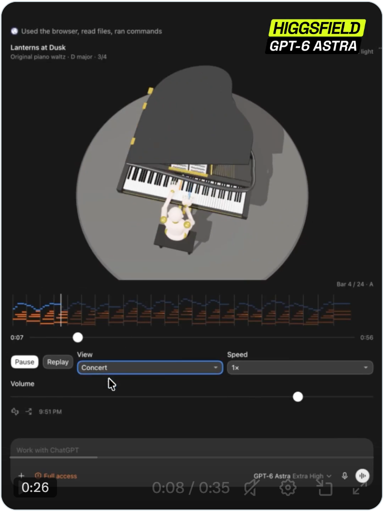</a><figcaption><a href="https://x.com/higgsfield_ai/status/2096292350180163648">Piano and pianist</a><span>Higgsfield · music and finger animation</span></figcaption></figure><figure><a class="demo-enlarge" href="images/replies-film.png" data-caption="A Room Made of Replies — Skye Sharkie · film and production tools" aria-label="Enlarge A Room Made of Replies">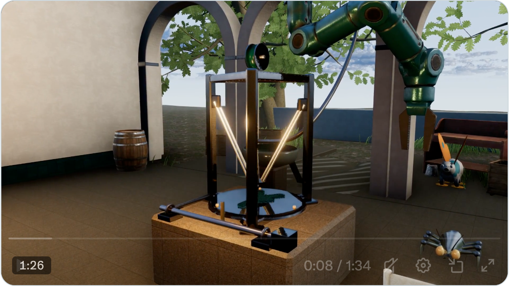</a><figcaption><a href="https://x.com/SkyeSharkie/status/2096276401204936939">A Room Made of Replies</a><span>Skye Sharkie · film and production tools</span></figcaption></figure><figure><a class="demo-enlarge" href="images/inception.png" data-caption="INCEPTION titles — @lepadphone · motion design" aria-label="Enlarge INCEPTION titles">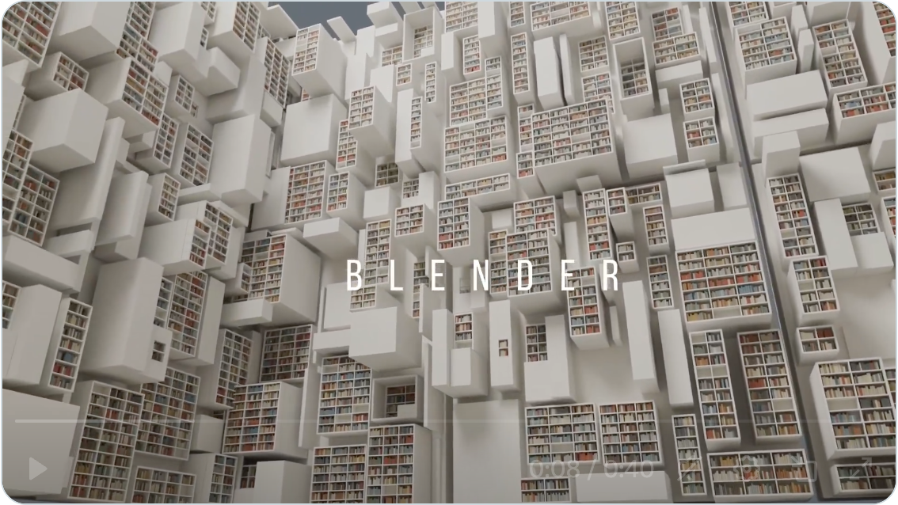</a><figcaption><a href="https://x.com/lepadphone/status/2096285071192035406">INCEPTION titles</a><span>@lepadphone · motion design</span></figcaption></figure><figure><a class="demo-enlarge" href="images/backrooms.png" data-caption="Backrooms — Duncan Trussell · atmospheric film" aria-label="Enlarge Backrooms">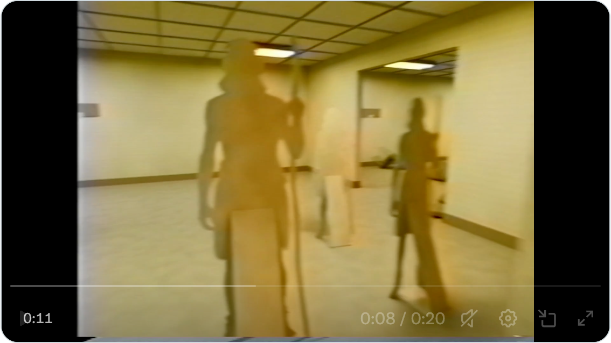</a><figcaption><a href="https://x.com/duncantrussell/status/2096003511104508411">Backrooms</a><span>Duncan Trussell · atmospheric film</span></figcaption></figure><figure><a class="demo-enlarge" href="images/tcell.png" data-caption="T-cell explainer — Derya Unutmaz · audiovisual teaching" aria-label="Enlarge T-cell explainer"></a><figcaption><a href="https://x.com/DeryaTR_/status/2095659170661904804">T-cell explainer</a><span>Derya Unutmaz · audiovisual teaching</span></figcaption></figure></div></section>
```

## Interfaces and Personal Tools

[Parallax Desk](https://x.com/outscape/status/2096286659566309605) is a spatial desktop reported to respond to the viewer's head position: lean to one side and nearby windows move differently from distant ones, revealing what is behind them. You can [open the workspace](https://parallax-desk.uhgall.chatgpt.site) to try that unusual approach to overlapping windows.

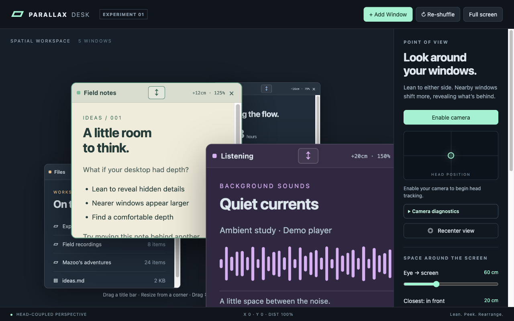{fig-alt="Overlapping notes, files, and code windows in Parallax Desk, with depth controls." width=760}

A [3D iPod-shaped application](https://x.com/skirano/status/2095648379455861054) turns Codex threads into something browsable through a familiar music-player interface. Schirano's [video-to-code demonstration](https://x.com/skirano/status/2095595938534351231) puts a reference animation beside a working card-customization interface. A designer can communicate an interaction by showing it, then get code to refine.

A [portrait painted into 9,216 Google Sheets cells](https://x.com/velvet_shark/status/2096284077150114303) is gloriously unnecessary, but it shows an agent coordinating thousands of edits inside an existing application. It tells us little about spreadsheet analysis, yet makes the breadth of computer-based work immediately visible.

Mollick's [living wiki](https://x.com/emollick/status/2095606622055760159) is quieter and, for my purposes, especially interesting. He describes converting personal correspondence, calendar material, and writing into a maintained knowledge resource with recurring briefings. The artifact is private, so the public evidence is limited. Still, the idea connects directly to a problem I care about: a personal archive should help recover and use information, not merely accumulate it. Source links and the ability to rebuild summaries would be essential to making such a system trustworthy.

A reported [Hazumi News database migration](https://x.com/jrzscodes/status/2096284357610610836) moves an existing application from Supabase to Cloudflare D1, two database services. The useful challenge is carrying an established system onto different infrastructure while preserving what users depend on.

Every's [production-rewrite evaluation](https://every.to/benchmarks/senior-engineer-benchmark) provides a more demanding check on software maintenance. Astra's reported result trails the human reference implementations, with unequal follow-up conditions complicating comparisons between models. Building an appealing new interface and safely changing an established system ask different things of an agent.


```{=html}
<section class="demo-gallery" aria-label="More examples: Interfaces and Personal Tools"><div class="gallery-toolbar"><span>More to explore · select an image to enlarge</span><div><button type="button" data-gallery="demo-gallery-7" data-step="-1" aria-label="Previous images in Interfaces and Personal Tools">←</button><button type="button" data-gallery="demo-gallery-7" data-step="1" aria-label="Next images in Interfaces and Personal Tools">→</button></div></div><div class="gallery-track" id="demo-gallery-7" tabindex="0" aria-label="Scrollable image gallery"><figure><a class="demo-enlarge" href="images/ipod.png" data-caption="Codex in an iPod — Pietro Schirano · spatial interface" aria-label="Enlarge Codex in an iPod">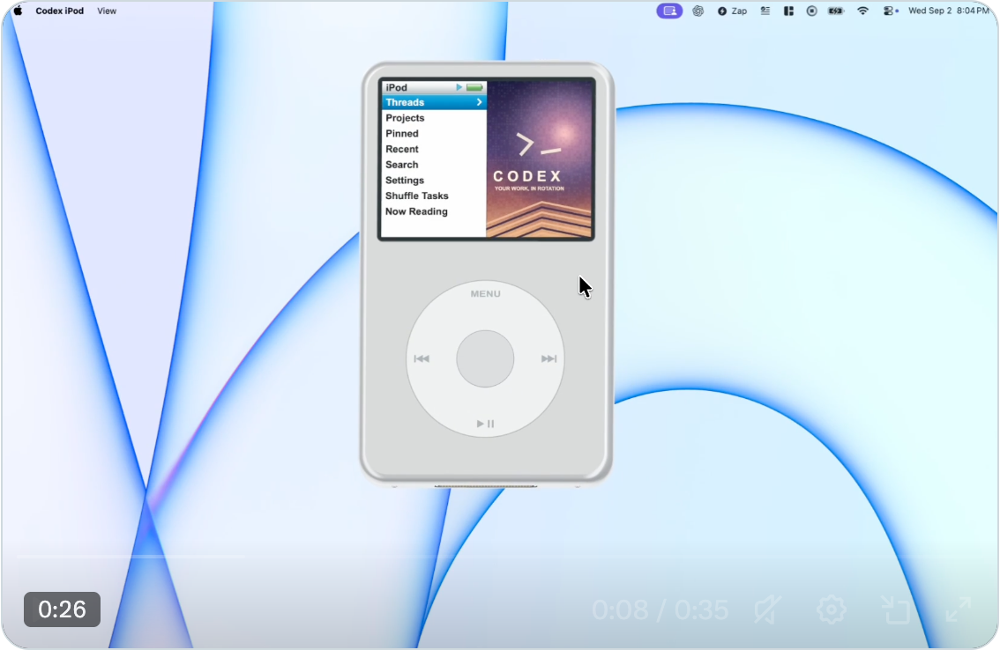</a><figcaption><a href="https://x.com/skirano/status/2095648379455861054">Codex in an iPod</a><span>Pietro Schirano · spatial interface</span></figcaption></figure><figure><a class="demo-enlarge" href="images/sheets.png" data-caption="Google Sheets portrait — @velvet_shark · 9,216 painted cells" aria-label="Enlarge Google Sheets portrait">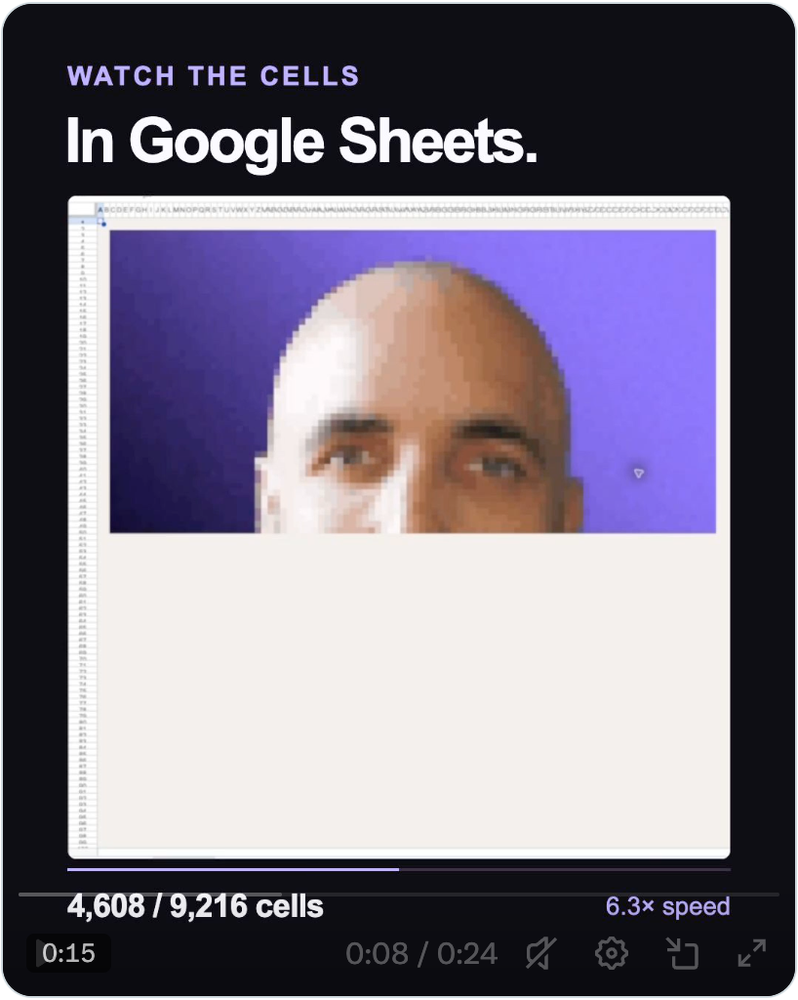</a><figcaption><a href="https://x.com/velvet_shark/status/2096284077150114303">Google Sheets portrait</a><span>@velvet_shark · 9,216 painted cells</span></figcaption></figure><figure><a class="demo-enlarge" href="images/video-interface.png" data-caption="Video to interactive code — Pietro Schirano · reference to interface" aria-label="Enlarge Video to interactive code">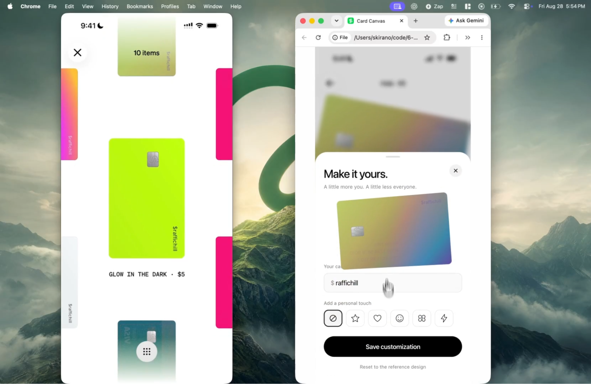</a><figcaption><a href="https://x.com/skirano/status/2095595938534351231">Video to interactive code</a><span>Pietro Schirano · reference to interface</span></figcaption></figure></div></section>
```

## What I Take From All This

Astra makes me more willing to attempt a project that crosses several tools or disciplines. The demonstrations show why: an agent can help carry a design into CAD, a world into a game engine, or an arrangement into a music application. Existing software, assets, and datasets supply substantial capabilities. Using them effectively is part of the achievement, and it helps explain what another person would need to reproduce the work.

I am especially interested in projects that leave something editable. The next request can build on the previous result: move the compute module, expose the interior, or change an instrument. That gives the person and the agent a concrete place to continue, with progress that can be inspected along the way.

Launch posts rarely disclose failed attempts, total spend, human interventions, or maintenance history. A one-prompt claim can conceal a long chain of work, and a public feed favors projects that look good in a short video. These examples reveal possibilities much more readily than typical cost or reliability.

There are already useful counterexamples. [Victor Taelin's allocator account](https://x.com/VictorTaelin/status/2096273196412498057) describes difficulty turning a diagnosis into a solution under real constraints. [Mollick's research-taste experiment](https://x.com/emollick/status/2095717185200988439) describes technically competent research choices that were not especially interesting. Execution and judgment both matter, and strength in one does not guarantee the other.

My response is to raise the ambition of what I try while keeping verification attached to the work. Change a CAD dimension and inspect what breaks. Follow a wiki summary back to its source. Compare a simulation with a known case, or play beyond a game's opening screen. The appropriate check depends on what the artifact is supposed to do.

Open [Waterloo](https://waterloo-guard-meets-the-line.vercel.app/) and change perspective, or inspect [the rover's revision request](https://x.com/Alpha10six/status/2096261751389978640). Choose an example close to something you understand well enough to judge, and consider what you would ask it to do next.

For more examples, browse the [full demonstration catalog](../2026-09-05-astra-demonstration-catalog/index.qmd), a summary table of all 82 demonstrations, experiments, and evaluations.

---

*Sources and scope: This article draws on a Codex-assisted survey of 72 candidates from 504 unique captured posts, followed by targeted searches, including CAD, anatomy, and Thornwake. Selection emphasized breadth, evidence, difficulty, and practical interest. Some applications were opened and selected interactions checked; most claims about production, cost, completeness, and accuracy remain the creators' accounts. This was not a controlled model comparison or a set of independently reproduced projects. The linked sources provide the fuller evidence, including benchmark protocols and qualifications. Images are application screenshots or frames from the attributed creators' demonstrations. Capturing a frame does not independently validate the project.*
