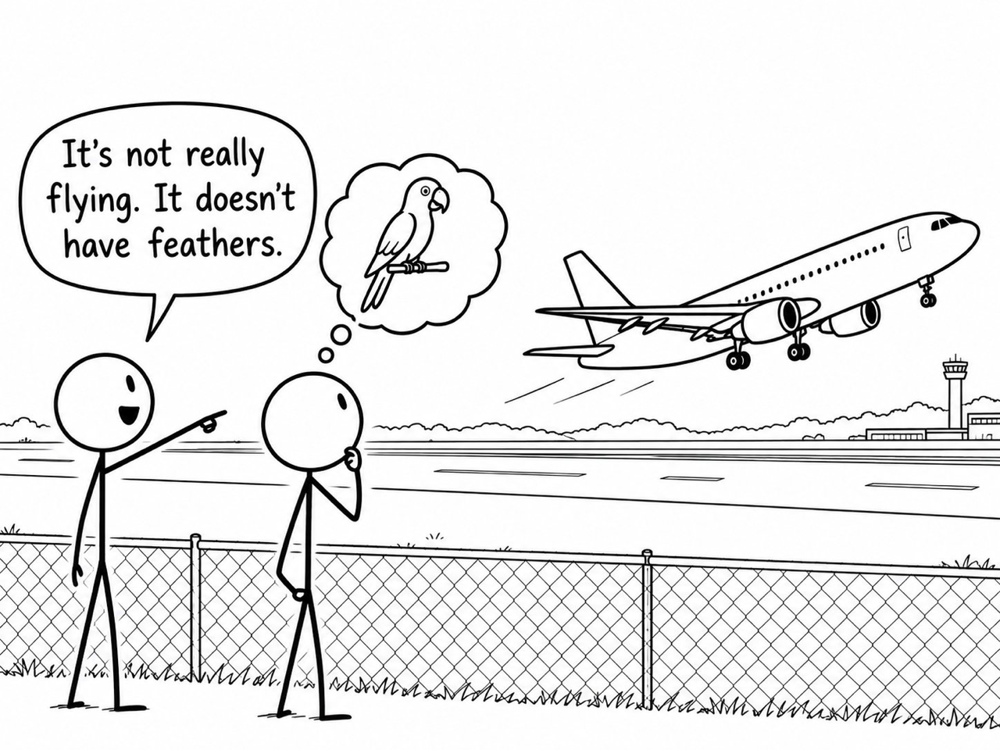

I’ve been using, teaching, and thinking about AI in various forms for about ten years. During that time, the capabilities have changed... considerably. As have my expectations of what these systems can do. But the language used to describe them has had a harder time keeping up.

This weekend, my X (aka the Twitter) feed filled with an argument sparked by the Associated Press' Stylebook account. It began with a firm declaration and advised journalists to avoid attributing human characteristics to AI.

```{=html}
<section class="x-carousel" aria-label="Original AP Stylebook post">
<div class="x-carousel-toolbar"><strong>AP’s guidance</strong></div>
<blockquote class="twitter-tweet" data-dnt="true" data-width="550" data-conversation="none"><p lang="en">Artificial intelligence systems do not think, feel, want or understand. Avoid language that gives them human characteristics. This is called anthropomorphizing, when we ascribe human traits, emotions or behaviors to non-human things, such as animals or inanimate objects.<br>Instead, explain what a system does, how well it performs, who built it and who could be affected by it.<br>https://t.co/UrgRobU97b</p>&mdash; APStylebook (@APStylebook) <a href="https://twitter.com/APStylebook/status/2102807962364383502">September 23, 2026</a></blockquote>
</section>
```

It sparked broad, sometimes vigorous, response. Based on a quick survey of 472 posts, by Sunday afternoon the discussion had accumulated nearly five million views, 45k likes, and thousands of reposts, replies, and bookmarks. The debate attracted a diverse audience of programmers, researchers, journalists, philosophers, and plenty of interested spectators.

I was pleased to recognize so much of it. In *Thriving with AI*, a cross-discipline undergraduate honors course I've offered since 2024, students are expected to consider what these systems can do, how they work, and what is meant when we describe them as *understanding*, *reasoning*, or *thinking*. Watching the same questions surface in a much wider conversation was welcome validation of that work.

The AP’s recommendation to describe behavior and consequences is sensible and responsible. Whatever result an AI system produces (helpful **or** harmful) any report of it *must* describe what happened and who made the relevant decisions. That is table stakes of credible journalism. It was the warning against anthropomorphization ("ascribe human traits, emotions or behaviors to non-human things") that drew attention from the likes of Paul Graham, Nate Silver, and others.

With its limit of ~120~ 240 words per post, *the platform formally known as Twitter* is not the place for subtle distinctions or nuanced debate impossible. That doesn't keep people from trying...

[Paul Graham](https://x.com/paulg/status/2103126673541755152) objected that cognitive language is already established usage. Programmers have long described software as remembering settings, deciding which process to run, or knowing where a file lives. Most of us can use those expressions without imagining a person inside the machine. Graham then [went further](https://x.com/paulg/status/2103135915195371973), suggesting that calling what LLMs do “thinking” will begin as a convenience and eventually become something we acknowledge as true.

I suspect that most readers will find the first of those arguments easy to accept. The second demands that we carefully consider what it means to *think* (also learn, understand, etc.). And that can be a slippery slope.

That distinction kept getting lost as the discussion spread. Nate Silver [pointed to coding agents](https://x.com/NateSilver538/status/2103278943067607302) that can examine a large program, debug it, and make revisions. Others emphasized that successful performance does not establish humanlike cognition or experience. Researchers debated whether “stochastic parrot” remains an informative description, and [whether claims about an earlier language model apply to a modern system](https://x.com/MelMitchell1/status/2103876313182527602) with additional training, tools, and feedback.

There are substantive disagreements here. But participants also keep answering different questions.

In class, we distinguish mechanistic, functional, and intentional accounts of a system. A mechanistic account describes how it works. A functional account describes what it accomplishes. An intentional account interprets its behavior in terms of beliefs and goals. Saying that a model generates tokens describes part of its operation. It doesn’t, by itself, tell us how well the model can diagnose a programming error. Successfully diagnosing that error doesn’t establish that it experienced the satisfaction of figuring something out.

{fig-alt="Two stick figures watch an airplane take off. One says, ‘It’s not really flying. It doesn’t have feathers.’ The other has a thought bubble containing a parrot." width=760}

The critics are right to warn about how easily we slide between these claims. Xaq has emphasized the dangers of unchecked anthropomorphism in our course, and I take those concerns seriously. A conversational system supplies cues we ordinarily associate with another person: fluent language, apparent attentiveness, encouragement, an apology when something goes wrong. We supply some of the meaning ourselves. As [Big Joel argued](https://x.com/biggestjoel/status/2103299447652245757), what one person regards as convenient shorthand may convey a claim about experience to someone else.

But I think some proposed remedies introduce more friction than understanding. My wife says I put the Dan in peDANtic. Even I recognize that clear communication depends on shortcuts. We cannot unpack the full meaning of every word each time we use it, and attempting to do so would make many explanations impossible to follow.

Much of what we communicate depends on compression. A concept we treat as simple can rest on a tower of human knowledge and experience. We use a few words because we expect them to call up enough of that background for someone else to follow. Sometimes that expectation fails. We discover that we mean different things, explain further, and try again.

A new technology can make use of familiar shortcuts too. Its novelty means we need to be more deliberate about establishing what those shortcuts mean and what they leave unresolved. It doesn’t make the shortcuts inherently illegitimate.

The intentional stance gives us a way to think about this. We can knowingly choose a description because it helps us understand and predict behavior. Saying that a chess program is trying to protect its queen needn’t confuse anyone about what the program is. The description has a purpose and a scope. Learning to use it well includes recognizing when we need a different explanation. Precision includes knowing what a description is useful for and where it stops working. It doesn’t require replacing every familiar expression with a description of the underlying computation.

```{=html}
<section id="discussion-posts" class="carousel x-carousel" aria-label="Posts behind the discussion" aria-roledescription="carousel" tabindex="0">
<div class="x-carousel-toolbar"><strong>Posts behind the discussion</strong><span role="status" aria-live="polite">1 / 5</span></div>
<div class="x-carousel-navigation" hidden><button class="btn btn-outline-secondary btn-sm" type="button" data-bs-target="#discussion-posts" data-bs-slide="prev" aria-label="Previous post">← Previous</button><div class="carousel-indicators">
<button type="button" data-bs-target="#discussion-posts" data-bs-slide-to="0" aria-label="Post 1" class="active" aria-current="true"></button>
<button type="button" data-bs-target="#discussion-posts" data-bs-slide-to="1" aria-label="Post 2"></button>
<button type="button" data-bs-target="#discussion-posts" data-bs-slide-to="2" aria-label="Post 3"></button>
<button type="button" data-bs-target="#discussion-posts" data-bs-slide-to="3" aria-label="Post 4"></button>
<button type="button" data-bs-target="#discussion-posts" data-bs-slide-to="4" aria-label="Post 5"></button>
</div><button class="btn btn-outline-secondary btn-sm" type="button" data-bs-target="#discussion-posts" data-bs-slide="next" aria-label="Next post">Next →</button></div>
<div class="carousel-inner">
<article class="carousel-item active" aria-label="1 of 5" aria-roledescription="slide"><h3>Established usage</h3><blockquote class="twitter-tweet" data-dnt="true" data-cards="hidden" data-width="550" data-conversation="none"><p lang="en">The AP doesn&#x27;t understand that this ship sailed years ago. What&#x27;s the use of a style guide that doesn&#x27;t understand current educated usage? Usage is the whole point of a style guide. https://t.co/tfGy5ruIxe</p>&mdash; Paul Graham (@paulg) <a href="https://twitter.com/paulg/status/2103126673541755152">September 24, 2026</a></blockquote></article>
<article class="carousel-item" aria-label="2 of 5" aria-roledescription="slide"><h3>What counts as thinking?</h3><blockquote class="x-quote" data-dnt="true" data-cards="hidden" data-width="550" data-conversation="none"><p lang="en">Using &quot;think&quot; to describe what an LLM does reminds me of the 16th century, when astronomers didn&#x27;t really believe in the heliocentric model, but used it for calculations anyway because the math was simpler. We&#x27;ll start by calling it thinking, then gradually acknowledge it is.</p>&mdash; Paul Graham (@paulg) <a href="https://twitter.com/paulg/status/2103135915195371973">September 24, 2026</a></blockquote></article>
<article class="carousel-item" aria-label="3 of 5" aria-roledescription="slide"><h3>Coding agents and capability</h3><blockquote class="x-quote" data-dnt="true" data-cards="hidden" data-width="550" data-conversation="none"><p lang="en">OK then give Astra or Fable a 10,000-line program, ask it to debug it, ask it to understand what&#x27;s going on, ask it to make revisions. It&#x27;s certainly not perfect. I&#x27;m bullish on human expertise fwiw. But it sure as hell is way more than a &quot;stochastic parrot.&quot; https://t.co/y6z5bzBoUz</p>&mdash; Nate Silver (@NateSilver538) <a href="https://twitter.com/NateSilver538/status/2103278943067607302">September 25, 2026</a></blockquote></article>
<article class="carousel-item" aria-label="4 of 5" aria-roledescription="slide"><h3>Which systems are we describing?</h3><blockquote class="x-quote" data-dnt="true" data-cards="hidden" data-width="550" data-conversation="none"><p lang="en">Everyone!  This is a straw-person argument.  The Stochastic Parrot paper was about LLMs of 2021, not the AI of today, which are not LLMs but complex software systems with vast post training and many external software components. https://t.co/hd7vmi5c3P</p>&mdash; Melanie Mitchell (@MelMitchell1) <a href="https://twitter.com/MelMitchell1/status/2103876313182527602">September 26, 2026</a></blockquote></article>
<article class="carousel-item" aria-label="5 of 5" aria-roledescription="slide"><h3>What the language implies</h3><blockquote class="x-quote" data-dnt="true" data-cards="hidden" data-width="550" data-conversation="none"><p lang="en">that people are taking issue with this is baffling to me. Reflective verbs like “wanting” and “feeling” and even “thinking” imply to most people that there is an experience associated with AI being. If that’s true, show it, don’t smuggle the belief in through convenient language https://t.co/Ew8TDi2RDo</p>&mdash; Big Joel (@biggestjoel) <a href="https://twitter.com/biggestjoel/status/2103299447652245757">September 25, 2026</a></blockquote></article>
</div>
</section>
```

Shared understanding is what we are trying to build through communication. Each exchange starts with whatever common ground we have and, ideally, extends it. That takes work from everyone involved. Speakers need to consider what their words imply to their audience. Listeners need to consider what a speaker could reasonably mean, ask when it is unclear, and remain willing to revise their interpretation.

None of this requires agreement. I can understand your position and your reasons for holding it while continuing to disagree. Shared understanding makes debate possible, and debate can reveal differences hidden beneath an apparent agreement. We need both.

This is where I think AP’s guidance takes the wrong shortcut. A vocabulary rule can substitute for the understanding it is supposed to encourage. Knowing to say “output” instead of “answer” tells me very little about whether someone understands the system. A writer can follow every terminology rule and still produce a misleading explanation. Someone using “thinking” can communicate clearly with readers who understand the intended scope.

Journalists do have a broad audience, and they cannot assume everyone shares a programmer’s conventions. That is a reason to explain carefully. Where a familiar term carries an implication the evidence cannot support, qualify it or choose another. But the replacement should improve the reader’s understanding. Sounding less human is not enough.

I want our students to develop the judgment to make those choices deliberately. That means examining an AI’s response, their own interpretation of it, a company’s claims, a skeptic’s dismissal, and a stylebook’s confident declaration. All deserve questions about meaning, evidence, and consequences.

That habit extends well beyond AI. We will always need language that compresses more than it spells out, and we will always encounter people who use it differently. The work is to understand what we are saying, help others understand it, and notice when our words have carried us further than our knowledge.

*Survey note: Engagement totals were captured on September 27, 2026, at approximately 1:15–1:19 p.m. Central time. The 472 unique posts came from selected discussion anchors and direct quote posts of AP’s guidance; this was a partial survey, not a census. Views are summed post impressions, not unique readers.*
